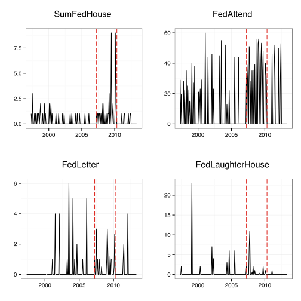
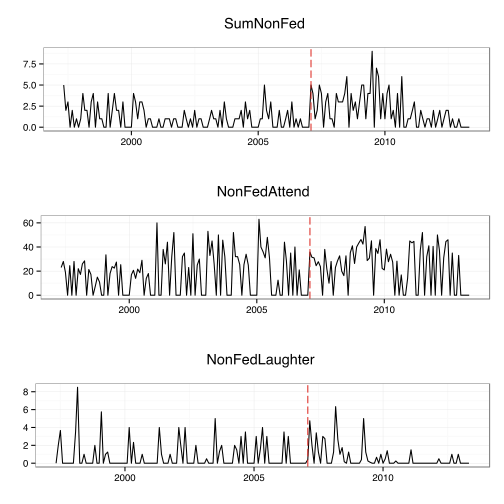
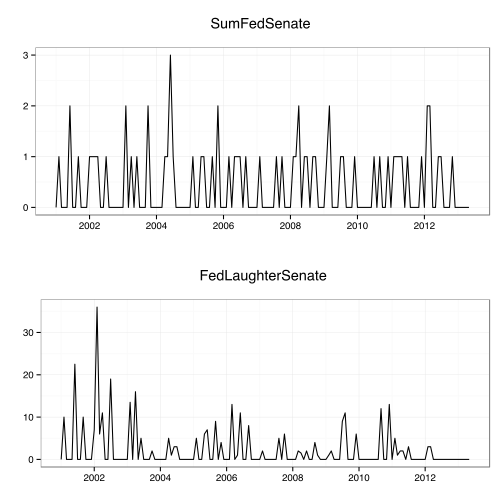
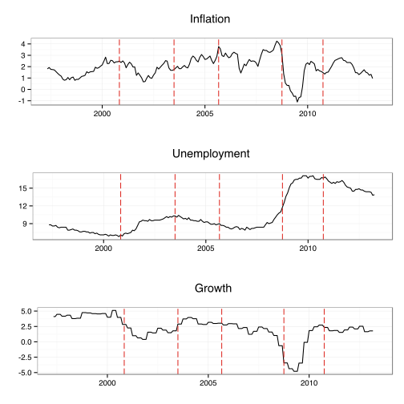

Legislative Scrutiny of the Fed & Its Responses
========================================================

## Kevin Young, Christopher Gandrud   & Stefano Pagliari

## EPSA Annual Conference

20 June 2013

US Federal Reserve's Missions
========================================================

 

The US Federal Reserve has two statutory obligations:

- Stable prices

- Promoting maximum employment

Legislative Scrutiny
========================================================

 

Legislative scrutiny of the Fed comes primarily from:

- Senate Committee on Banking, Housing, & Urban Affairs (**SBHUA**)

  - Also approves the president's chairman and governor nominations.

- House Committee on Financial Services (**HCFS**)

Research Questions
========================================================

 

- When does Congress **increase its scrutiny** of the FOMC?

- Does the Fed **respond** to increased scrutiny by changing the groups talks to?

Hypotheses & Previous Literature
========================================================

 

## WE NEED TO FILL IN

Scrutiny States
========================================================

 

We used **change point analysis** to determine when Congress changes its level of scrutiny of the Fed.

In particular, we used [Matteson and James' (2012)](http://www.stat.cornell.edu/~matteson/papers/MattesonJames2012a.pdf) [energy divisive hierarchical change point estimation algorithm](http://cran.r-project.org/web/packages/ecp/).

- Allowed us to estimate if the joint multivariate distribution of sequences of observed data changes.

Congressional Hearing Data (1)
========================================================

 

Our change point models included:

- **Number of hearings** held by the full SCBUA and HCFS where a representative of the Fed gave testimony.

- **Number of hearings** held by the full HCFS (incomplete data for SCBUA).

- Number of **attendees** per hearing.

- Number of times **written answers** to questions were requested (HCFS only).

- Number of times **laughter** was recorded in the transcripts.

Congressional Hearing Data (2)
========================================================

 

Data was found at the US [Government Printing Office](http://www.gpo.gov/fdsys/browse/committeetab.action), [SCBUA](http://www.banking.senate.gov/public/index.cfm?FuseAction=Hearings.Home), and [HCFS](http://financialservices.house.gov/archives/) websites.

All data was **agregated by month** (counts or averages).

Data was available from from **mid-1996** through **2012**.

Results: HCFS Hearings with Fed
========================================================

Results: HCFS Hearings without Fed
========================================================

Results: SCBUA Hearings with Fed
========================================================

Comparison: Economic Conditions
========================================================

How Does the Fed Respond?
========================================================

## WE NEED TO FILL IN

Fed Board's Network: 199
========================================================

 
 

 

Fed Board's Network: 2012
========================================================
